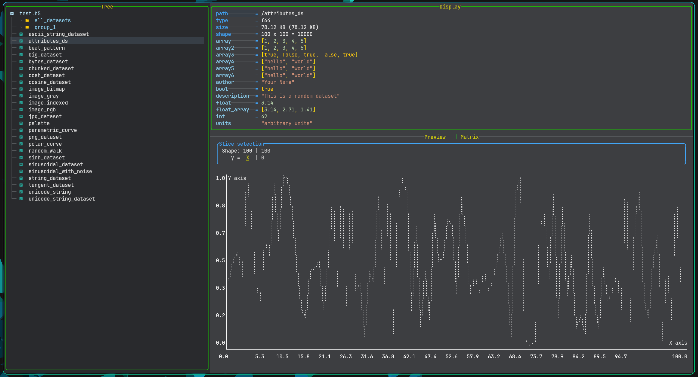
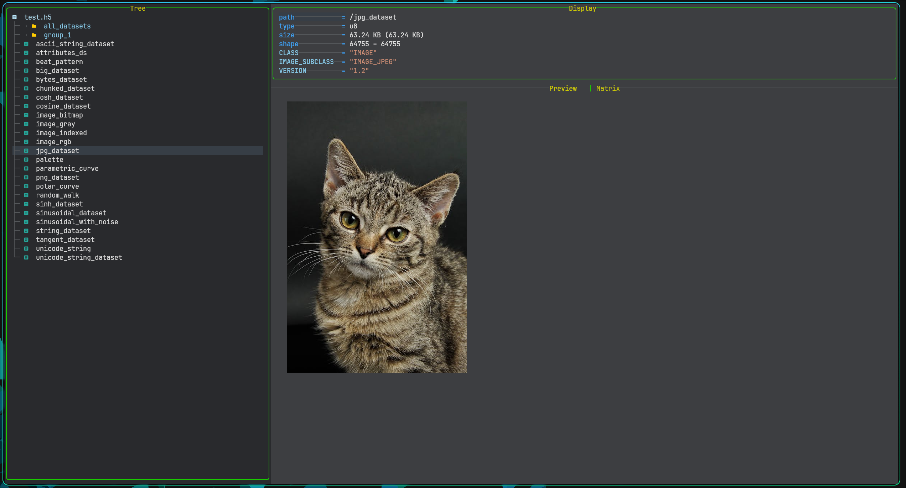
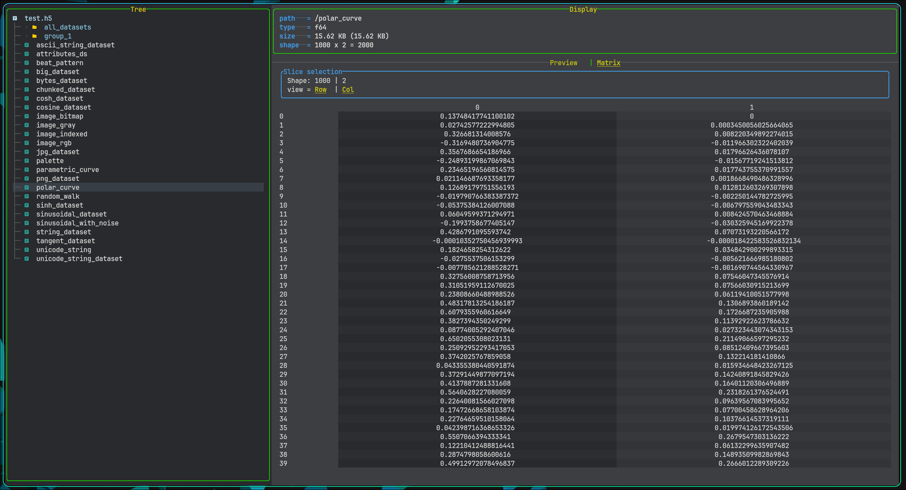

# h5v

HDF5 Terminal Viewer.

It is a viewer for HDF5 files, allowing you to explore the contents of HDF5 files in a terminal with chart,string, matrix and image previews of the data including attributes.

Run `h5v` with the path to an HDF5 file:

```bash
h5v path/to/file.h5
```





## Controls

- `j`/`k`/`up`/`down`: Navigate through the items
- `enter`/`space`/`l`/`h`: Open/close items
- `shift` + navigate: shift focus
- `q`: Quit
- `y`: Copy highlighted to clipboard
- `ctrl` + navigate: Scroll through contents (image list or matrix)

## Installation

Must have rust and hdf5 lib installed, then run:

```bash
cargo install h5v
```
