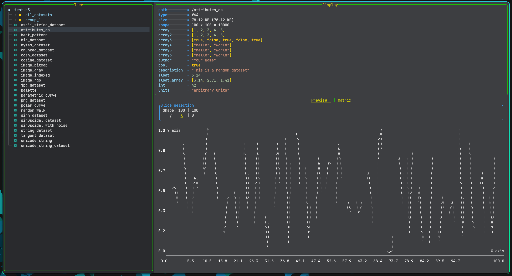
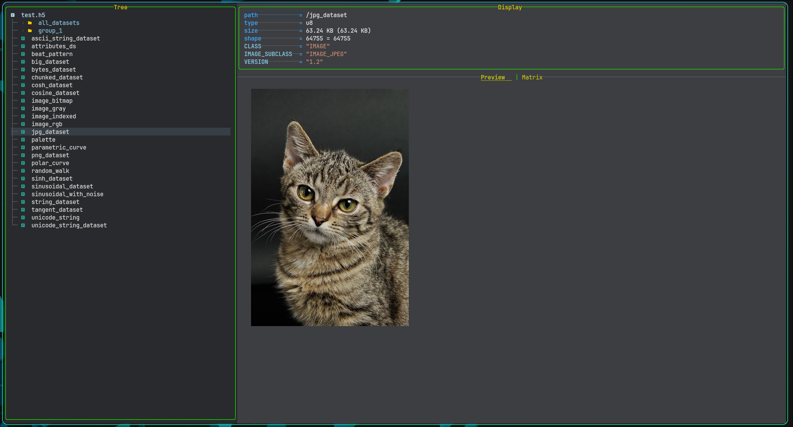
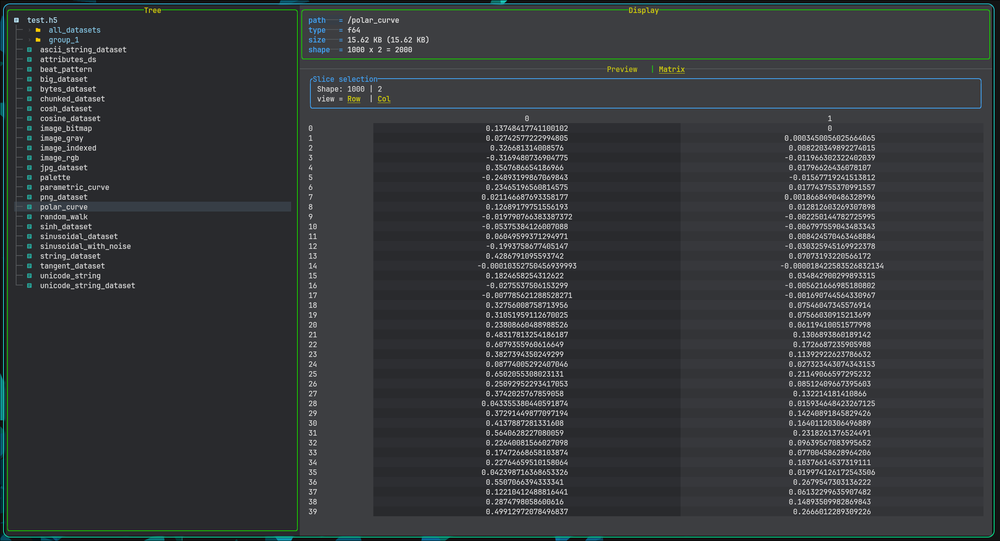

# h5v

HDF5 Terminal Viewer.

It is a viewer for HDF5 files, allowing you to explore the contents of HDF5 files in a terminal with chart,string, matrix and image previews of the data including attributes.

Run `h5v` with the path to an HDF5 file:

```bash
h5v path/to/file.h5
```





## Controls

- `j`/`k`/`up`/`down`: Navigate through the items
- `enter`/`space`/`l`/`h`: Open/close items
- `shift` + navigate: shift focus
- `q` / `ctrl`+`c`: Quit
- `y`: Copy highlighted to clipboard
- `ctrl` + navigate: Scroll through contents (image list or matrix)
- `PgUp`/`PgDown`: Scroll through contents by half a page (image list or matrix)
- `ctrl` + `d`/`u`: Navigate by half a page
- `alt` + `left`/`right`: Change the pivot for incrementing constant indexes in matrix and preview modes.
- `alt` + `up`/`down`: Increment or decrement index at highlighted index in matrix and preview modes.
- `c`/`C`: Shift column axis in matrix mode.
- `r`/`R`: Shift row axis in matrix mode.
- `x`/`X`: Shift x-axis selector in preview mode.
- `g`/`Home`: Go to the top
- `G`/`End`: Go to the bottom
- `m`: Add currently selected preview to multichart
- `M`: Toggle multichart mode
- `:` Enter command mode
- `.` repeat last command
- `?`: Show help

## Multichart mode

- `backspace/delete/d`: Remove currently selected source from multichart
- `M`: Toggle back to normal mode
- `c`: Clear zoom
- `shift` + `right`/`left`: Pan right/left
- `shift` + `up`/`down`: Zoom in/out by 10%

## Edit mode

Shift focus to an attribute name or value or preview value and press `enter` or `e` to enter edit mode. Edit mode will open \"$EDITOR\" with the current value. Edit the value then save and close the editor to update the value in the file.

## Commands

- `:n` Go the nth item
- `:+n` Go down n items
- `:-n` Go up n items

For example, `:5` will go to the 5th item, `:+3` will go down 3 items, and `:-2` will go up 2 items.
Use `:` to enter command mode, type the command, and press `enter` to execute it.
Use `.` to repeat the last command.

## Installation

```bash
cargo install h5v
```

## Roadmap

### Pre-release distribution features

- [ ] Improve rendering UX -> Multithread -> Rendering spinner
- [ ] Fix attribute write on fixed length string attributes
- [ ] Fix issue related to segmentation errors (last segment fetched too many)
- [ ] Prebuilt binaries for common platforms (distribution)

### Post pre-release features

- [ ] Edit file on readonly -> ask to open in write mode.
- [ ] Add edit value for dataset values (scalar and single values)
- [ ] Adding/Updating/Deletion of attributes/matrix values
- [ ] Add support for enums
- [ ] Add support for compounds
- [ ] Add support for compounds (treeview repr of fields recursively + select fields and if field is regular then preview as usual)
- [ ] Add more command support: All actions could be cmd'able -> delete attribute, remove dataset from multi-chart, go up 50, etc. Anything that could change the state basically.
