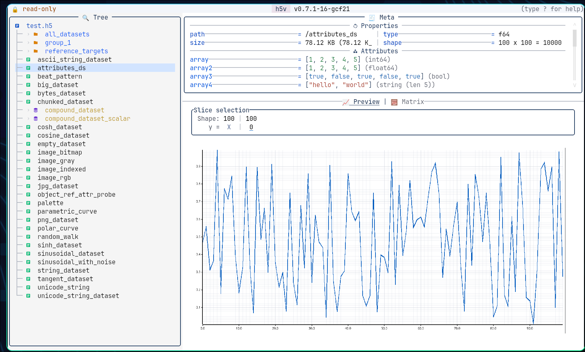

<div class="oranda-hide">
<p align="center" class="hide-">
  
</p>
</div>

> **A terminal-first HDF5 explorer for charts, matrices, images, compound schemas, and scripted workflows.**

```bash
curl -fsSL https://raw.githubusercontent.com/DanielHauge/h5v/main/install.sh | sh
```

The shell installer works on Linux, macOS, and POSIX-style Windows shells such as Git Bash, MSYS2, and Cygwin. It now prefers conventional install locations: `/usr/local/bin` when writable, `~/.local/bin` on Unix-like systems without a writable system prefix, and `%LOCALAPPDATA%\Programs\h5v\bin` on Windows shells. On Windows, the PowerShell installer or Scoop is usually the more natural choice.

`h5v` is a Rust TUI for inspecting HDF5 files without leaving the terminal. It is built for fast data exploration: browse the tree, switch between chart and matrix views, inspect image datasets inline, drill into compound fields, edit attributes in write mode, and script startup workflows for repeatable sessions.

<div class="oranda-hide">

## What it looks like

| Charts | Images |
| --- | --- |
|  |  |
| Multichart | Commands |
|  |  |
| Help | Scripting |
|  |  |

## Highlights

- Explore datasets, groups, links, and synthetic compound-field nodes from a tree view.
- Switch between preview, matrix, schema, and image-oriented views from the same selection.
- Edit values and scalar attributes in place when the file is opened with `-w`.
- Automate repeatable sessions with `--command`, `--script`, `--script-test`, and simulated `press ...` input.
- Build derived comparisons and expression-based overlays in multichart mode.

</div>

## Quick start

If you do not have an h5 file, you can download an example:

```bash
curl -fsSL https://raw.githubusercontent.com/DanielHauge/h5v/main/examples/h5v-example.h5 -o h5v-example.h5
``` 

Open a file in read-only mode:

```bash
h5v h5v-example.h5
```

If your terminal renders icons, line drawing, or graphics previews badly, start in compatibility mode:

```bash
h5v --compatibility h5v-example.h5
```

That switches the UI to simpler fallback symbols and disables terminal graphics previews. To make that the default for your shell sessions, set `H5V_COMPATIBILITY_MODE=true` in your rc file such as `~/.bashrc`, `~/.zshrc`, or `~/.config/fish/config.fish`.

Open the same file in write mode so edits are allowed:

```bash
h5v -w h5v-example.h5
```

Persistent themes and color overrides can be configured in Lua. Inside `h5v`, run `:configure` to open `init.lua`, or `:configure reset` to regenerate the default scaffold.


Start with scripted commands:

```bash
h5v examples/h5v-example.h5 \
  -c "goto /matrices/cube" \
  -c "focus content" \
  -c "mode matrix"
```

Validate a startup script without launching the UI:

```bash
h5v path/to/file.h5 --script-test --script setup.h5v
```

Try the bundled example file and walkthrough script from this repository:

```bash
h5v examples/h5v-example.h5 --script examples/h5v-example.h5v
```

Regenerate the example file after editing the generator:

```bash
python scripts/generate_example_h5.py
```

## Installation

| Method | Command |
| --- | --- |
| Shell installer | `curl -fsSL https://raw.githubusercontent.com/DanielHauge/h5v/main/install.sh \| sh` |
| PowerShell installer | `irm https://raw.githubusercontent.com/DanielHauge/h5v/main/install.ps1 \| iex` |
| Homebrew | `brew install DanielHauge/h5v/h5v` |
| Scoop | `scoop bucket add h5v https://github.com/DanielHauge/h5v && scoop install h5v/h5v` |
| cargo-binstall | `cargo binstall h5v` |
| Cargo source build | `cargo install h5v` |

On Windows, `install.ps1` installs into `%LOCALAPPDATA%\Programs\h5v\bin` and adds that directory to the user `PATH`.

On Linux, source builds may require native packages such as `cmake`, `pkg-config`, `libfontconfig`, `freetype`, and `expat` development headers.

## Configuration

Themes, symbol sets, and per-key color overrides are configurable in Lua. Inside `h5v`, run `:configure` to open `init.lua`, then set `h5v.theme = "light"` or override only the specific colors you want. `:configure reset` regenerates the default scaffold with the current built-in theme catalogs.



## Documentation

The full manual is published as an mdBook at [danielhauge.github.io/h5v/book](https://danielhauge.github.io/h5v/book/), and the source lives in [`docs/src`](https://github.com/DanielHauge/h5v/tree/main/docs/src).

| Guide | Link |
| --- | --- |
| Book contents | [Overview](https://danielhauge.github.io/h5v/book/) |
| Installation | [Installation](https://danielhauge.github.io/h5v/book/installation.html) |
| Navigation and layout | [Navigation](https://danielhauge.github.io/h5v/book/navigation.html) |
| Controls reference | [Controls](https://danielhauge.github.io/h5v/book/controls.html) |
| HDF5 support and previews | [HDF5 support](https://danielhauge.github.io/h5v/book/hdf5-support.html) |
| Images and conventions | [Images](https://danielhauge.github.io/h5v/book/images.html) |
| Commands and scripting | [Commands](https://danielhauge.github.io/h5v/book/commands.html) |
| Configuration and theming | [Configuration](https://danielhauge.github.io/h5v/book/configuration.html) |
| Multichart guide | [Multichart](https://danielhauge.github.io/h5v/book/multichart.html) |
| Bundled example workflow | [`examples/h5v-example.h5`](https://github.com/DanielHauge/h5v/blob/main/examples/h5v-example.h5) and [`examples/h5v-example.h5v`](https://github.com/DanielHauge/h5v/blob/main/examples/h5v-example.h5v) |

## Core interaction model

- `Shift` + arrow keys or `Ctrl+W` then `h/j/k/l` move focus between panes.
- `Tab` cycles content modes when the current dataset can be shown in more than one way.
- `:` opens the command minibuffer, `.` repeats the last command, and `?` opens the in-app help overlay.
- `m` adds the current previewable selection to multichart and `M` opens multichart mode.
- `s` toggles the sidebar, `/` enters search, and `Ctrl+R` reloads the file from disk.
