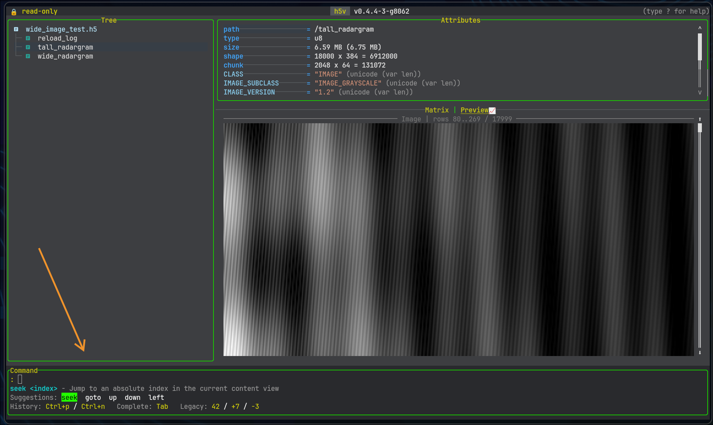

# Commands

## Command minibuffer



Press `:` to open the command minibuffer. Commands are parsed with completion, history, aliases, and quoted argument handling, which makes them useful for both interactive use and startup automation.

Useful minibuffer behavior:

- `Tab` cycles matching completions
- `Shift+Tab` and arrow keys move through suggestions
- `Ctrl+P` / `Ctrl+N` browse command history
- `help` or `help <command>` shows command help
- `.` repeats the last successful command

## Core command families

### Navigation

```text
goto /signals/sine_wave
seek 5
down 3
left 2
page-down
```

### Focus and view control

```text
focus tree
focus attributes
focus content
mode preview
mode matrix
toggle-tree
reload
configure
configure reset
```

### Selection control

```text
x next
row prev
col next
dim next
index next 10
```

### Attribute operations

```text
attr create title string "release candidate"
attr delete title
```

### Multichart operations

```text
mchart open
mchart add !/signals/sine_wave
mchart visible
mchart base toggle
mchart select next
mchart expr "($1, !/signals/cosine_wave)"
mchart derive difference
mchart zoom in 25
mchart pan right 10
```

## Multichart command surface

The `mchart` command family is broader than the quick examples suggest. Supported actions include:

- `open`, `show`, `close`, `hide`, `toggle`
- `add`
- `expr`, `expression`, `prompt`
- `base toggle`, `base clear`
- `derive`
- `select`, `move`
- `visible toggle`, `visible show`, `visible hide`
- `remove`, `delete`
- `clear`, `clear all`, `clear zoom`
- `zoom in`, `zoom out`, `zoom reset`
- `pan left`, `pan right`

When used without an explicit path, `mchart add` captures the current previewable tree selection. That includes groups with `H5V_PREVIEW_EXPR`, which are added as expression-derived chart items.

## Aliases and numeric shorthand

Legacy numeric aliases still work:

```text
:5
:+3
:-2
```

They map to:

- `:5` -> `seek 5`
- `:+3` -> `down 3`
- `:-2` -> `up 2`

## Quoting and parsing

Quoted strings are supported in commands and scripts, including multichart expressions and attribute values. This is especially important for:

- attribute values with spaces
- command scripts containing expression tuples
- `press ...` commands that need modifier sequences

The `press` command dispatches through the real keymap. For example:

```text
press ctrl+w o
press M j enter
```

Try these against the bundled example file:

```bash
h5v examples/h5v-example.h5
```

For the Lua config file, theme overrides, and the `configure` / `configure reset` workflow, continue with [Configuration and theming](./configuration.md).

For startup usage, continue with [Startup scripting](./startup-scripting.md).
