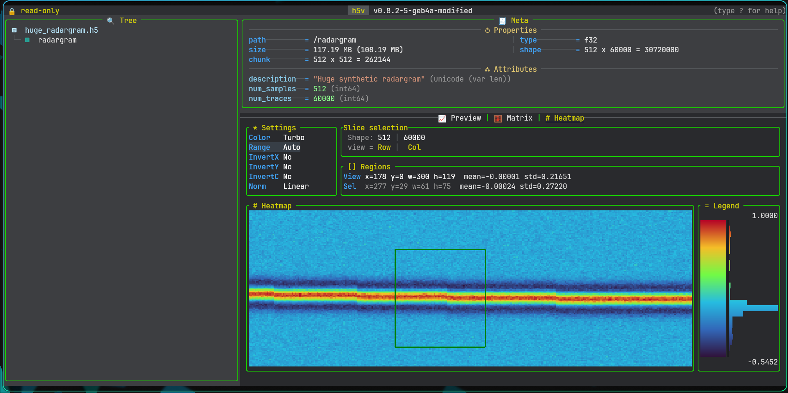

# Heatmap

Heatmap is the image-style view for numeric datasets with at least two non-singleton dimensions.

It is available only when:

- compatibility mode is off
- terminal image rendering is available

## What it shows

- a rendered 2D slice
- slice/page context
- settings
- viewport stats
- optional selection stats
- legend and histogram

## Settings

The settings panel controls:

- colormap
- range mode
- invert x
- invert y
- invert colors
- normalization

Built-in range modes include `Auto`, `MIN/MAX`, `Clip 1-99%`, `Sigma +-2sigma`, and `Winsor 2-98%`.

Use `Up` / `Down` to move between settings and `Left` / `Right` to change the selected value. Click a settings row to focus it directly.

## Selection and viewport

- no explicit selection means the active region is the current viewport
- one left click selects one terminal-cell region
- a second left click expands that to a rectangle
- another left click after a rectangle clears the explicit selection

The region panel shows both:

- viewport `x/y/w/h`, `mean`, `std`
- selection `x/y/w/h`, `mean`, `std`

## Zoom and pan

- `z` zoom in
- `Z` zoom out
- `0` reset viewport
- `v` clear explicit selection
- `H` / `J` / `K` / `L` pan the zoomed viewport
- `PageUp` / `PageDown` move through segmented heatmap pages

## Mouse

- left click selects a region
- wheel zoom is anchored to the hovered cell
- right click on an explicit selection zooms into that selection
- right-click drag pans the viewport

## Commands and scripts

Heatmap uses the existing movement commands:

- `up` / `down`
- `left` / `right`
- `page-up` / `page-down`

Dedicated heatmap range commands:

- `heatmap range list`
- `heatmap range use "Clip 1-99%"`
- `heatmap range add 5% 80% "5-80%"`
- `heatmap range add 2.5 5.5 "2.5..5.5"`

Zoom, reset, clear selection, and viewport pan are key-driven. In scripts, use `press`:

- `press z`
- `press Z`
- `press 0`
- `press v`
- `press H`

## Copy

`y` copies the active heatmap summary:

- selection summary when a region is selected
- viewport summary otherwise

## Configuration

Heatmap configuration:

- include `heatmap` in `h5v.content_mode_order`
- style shared panel/title colors through `h5v.colors`
- style shared symbols through `h5v.symbols`
- set `h5v.heatmap.default_range`
- set `h5v.heatmap.default_colormap`
- set `h5v.heatmap.default_normalization`
- set `h5v.heatmap.default_invert_x`
- set `h5v.heatmap.default_invert_y`
- set `h5v.heatmap.default_invert_c`
- add `h5v.heatmap.range_modes`
