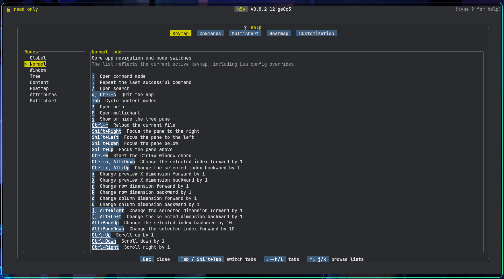

# Introduction

h5v is a terminal HDF5 viewer and editor.

It provides:

- tree navigation for groups, datasets, links, and projected compound fields
- preview, matrix, heatmap, image, and schema views
- attribute inspection and editing
- command and startup-script automation
- multichart comparison

Start with [Installation](./installation.md) and [Quick start](./quick-start.md).
