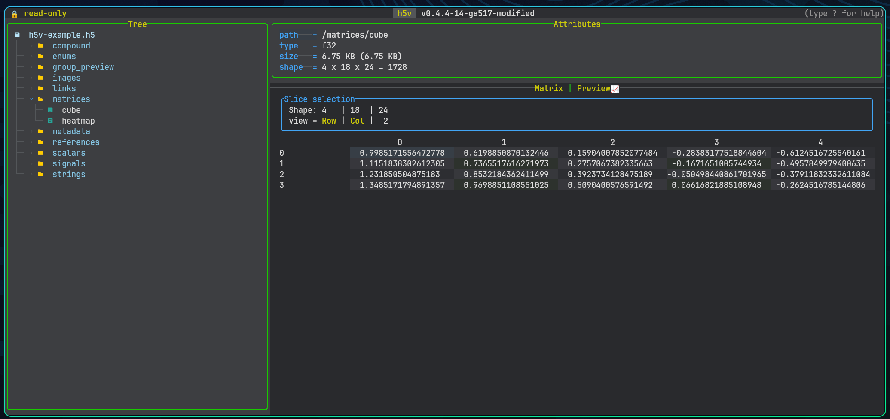

# Matrix views

## When matrix mode is available

Matrix mode appears when the current dataset or projected compound field is matrixable and has more than one effective element. Use `Tab` to move between preview and matrix mode when both are available.

## Dimension selection

For datasets with more than two dimensions, h5v exposes selectors for:

- the row axis
- the column axis
- the currently selected extra dimension
- the active index value for fixed dimensions

Dimensions with size `1` are forced to index `0`. The row and column axes must stay distinct, and the selected-dimension controls let you walk a higher-dimensional array one slice at a time.

## Rendering behavior

### Numeric values

Numeric datasets render as dense tables with one line per row. Column widths are sized for readable values and a minimum width of `24` characters.

### Enums

Enums render with symbol and color mapping so repeated categories are easier to scan visually.

### Strings

String matrices render inline with widths adjusted to the visible content.

### Compound fields

Compound container roots can render in matrix mode as a read-only table with one row along the selected record dimension and one column per direct field. Horizontal scrolling moves across fields, while any additional dataset dimensions remain fixed to the currently selected indices. Individual projected leaf fields can also render in matrix mode once you drill down to a matrixable field.

## Practical workflow

Use matrix mode when:

- the shape is dense enough that spatial layout matters more than trend shape
- you need to compare neighboring values directly
- a chart preview hides too much structure in a higher-dimensional slice

Switch back to preview mode when trend shape matters more than cell-by-cell inspection.
