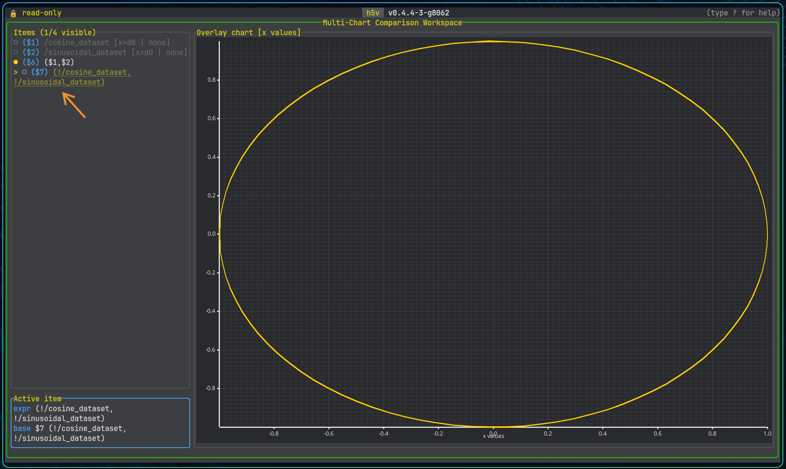

# Multichart expressions

## Supported references

Multichart expressions can refer to existing chart items, datasets, and attributes directly, but the reference type is always explicit.

| Syntax | Meaning |
| --- | --- |
| `$1` | Chart item series by workspace id |
| `!/dataset` | Dataset series |
| `!/dataset[..,0]` | Dataset series with explicit slicing |
| `!/group:trace` | Series-valued attribute on a group or dataset |
| `!$1:trace` | Series-valued attribute on the dataset backing chart item `$1` |
| `#/group/scalar` | Scalar dataset value |
| `#/group/ds:BIAS` | Scalar attribute on a group or dataset |
| `#$1:SCALE` | Scalar attribute on the dataset backing chart item `$1` |

## Y-series and x/y-series

An expression can produce:

- a normal y-series
- a tuple-based x/y series

Examples:

```text
$1 * #$1:SCALE
!/signals/sine_wave + #/group_preview/offset
($1 * #/group_preview:scale, !/group_preview/time)
```

The tuple form is the most important one for custom x/y plots because it gives you explicit control over both axes.

The same syntax is also used by group preview expressions. In the bundled example, `/group_preview` defines:

```text
(!/group_preview/time, (!/group_preview/value - #/group_preview/offset) * #/group_preview:scale)
```

Here is an example of a parametric x/y series using sine and cosine signals to form a circle:

```text
(!/signals/sine_wave, !/signals/cosine_wave)
```



## Interactive prompt

Open the expression prompt with:

- `e` in multichart mode, or
- `mchart prompt`

Submit with `Enter` and cancel with `Esc`. Invalid expressions are reported inline so you can fix them without leaving the workspace.

## Practical tips

- add a raw dataset first so you have stable `$1`, `$2`, and `$3` references to build from
- use `:ATTR` only when you want an explicit attribute lookup on an object or dataset-backed chart item
- prefer explicit dataset slicing when the same dataset can be interpreted several ways
