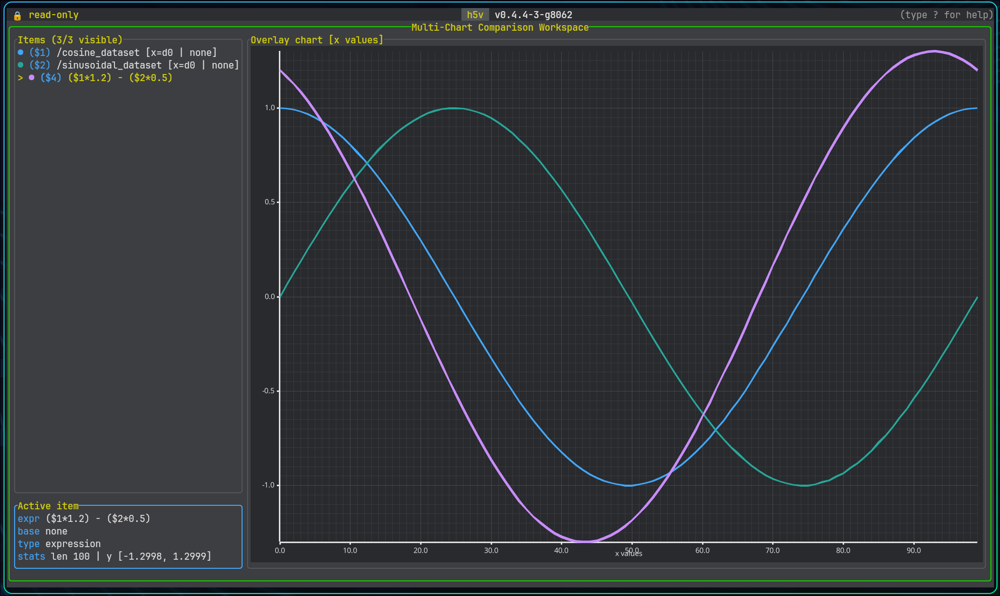

# Multichart

Multichart is the comparison workspace for previewable series.

Sources:

- the currently selected previewable tree selection
- an explicit dataset reference
- an expression-defined series

## Basic workflow

1. Add a series with `m` or `mchart add ...`.
2. Press `M` or run `mchart open` to enter the workspace.
3. Press `Enter` to open a new expression, or `e` to edit the selected series.
4. Build derived series with expressions such as `$1 - $2`, `($1, !/time[..])`, or `$1[0..256]`.
5. Use zoom and pan to inspect the area of interest.

Groups with `H5V_PREVIEW_EXPR` also work here. Pressing `m` on `/group_preview` adds the group preview expression as a chart item.

## Expression editor

- `Enter` opens a new expression without changing the chart viewport
- `e` edits the selected series in place
- `Enter` submits the current expression
- `Tab` completes the selected suggestion
- `Up` and `Down` move through suggestions while editing
- `Esc` closes the editor

The editor validates expressions live and suggests chart item ids, dataset paths, and attribute references.

## Visibility and organization

- move through chart items with `j` / `k`
- hide or show an item with `Space` or `v`
- remove the selected item with `d`, `Backspace`, or `Delete` when nothing depends on it
- clear the whole workspace with `C`
- open multichart help with `?`

## Zoom and pan

- `+`, `=`, or `Shift+Up` to zoom in
- `-` or `Shift+Down` to zoom out
- `h` / `Shift+Left` to pan left
- `l` / `Shift+Right` to pan right
- `c` to reset zoom

The same actions are available from the command line.

## Expression workflows

See [Multichart expressions](./multichart-expressions.md) for syntax and [Command reference](./command-reference.md) for the full `mchart` command surface.
