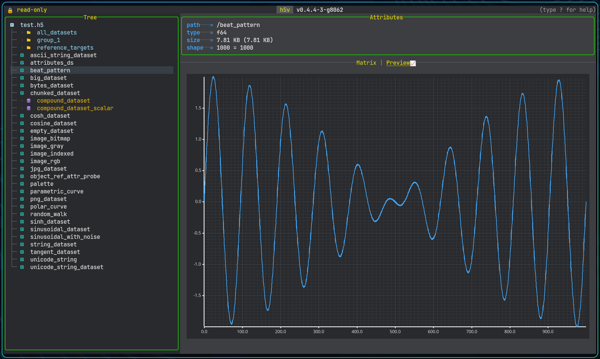

# Preview types

## Numeric chart preview



h5v renders numeric datasets as a line plot over a selected one-dimensional slice.

- active x-axis dimension
- fixed indices for the other dimensions
- visible slice when the data is segmented

Use `x` / `X`, `[` / `]`, and the index controls to move through higher-dimensional data.

Large previews are segmented at `250000` elements. `PageUp` / `PageDown` move between segments.

If a slice contains only invalid numeric values such as `NaN` or infinity, h5v reports that bounds cannot be computed.

## Scalar and string preview

Scalar datasets render as text. This covers:

- floating-point scalars
- signed and unsigned integer scalars
- fixed and variable strings

Scalar enums use the enum renderer, including optional `SYMBOLS` and `COLORS` overrides.

String datasets can carry syntax-highlighting hints. Resolution order:

- `HIGHLIGHT` attribute on the dataset
- dataset name extension such as `.py` or `.yml`

## File preview

Selecting the root file node shows filesystem metadata such as path, size, timestamps, permissions, and open mode.

## Schema preview for compounds

Selecting the root of a compound dataset shows a recursive schema preview.

Projected compound leaves follow their field type:

- `/compound/nested_records/gain` previews like a numeric field
- `/compound/nested_records/window` is matrixable and editable as one value per line
- projected enum leaves can inherit custom symbol/color styling from dataset metadata
- projected multi-value string arrays stay matrix-only instead of attempting chart preview

## Group preview

If a group has a variable-length string attribute named `H5V_PREVIEW_EXPR`, h5v evaluates it with the same syntax as multichart and renders the result in the preview pane.

The bundled example includes `/group_preview`:

```text
(load(/group_preview/time), (load(/group_preview/value) - load(/group_preview/offset)) * load(/group_preview:scale))
```

Press `m` on that group to add the same expression to multichart.

## Image preview

Datasets recognized as HDF5 images render inline in the content pane. See [Images](./images.md) for behavior and [Image conventions](./image-conventions.md) for the required metadata.


