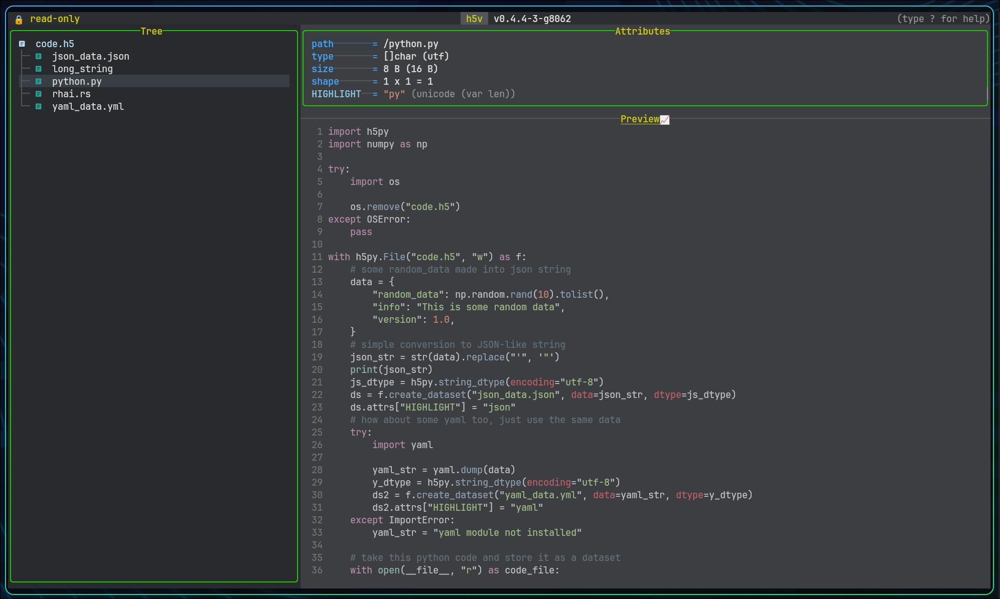

# Startup scripting



## Sources

1. `--script <PATH>`
2. `--script -`
3. piped stdin
4. repeated `--command` / `-c`

Order: scripts first, then stdin, then inline commands.

Startup scripts use the same command parser as the minibuffer. That includes:

- navigation commands
- view and focus commands
- attribute commands
- multichart commands
- `press <keys>` sequences

## Validation mode

Use `--script-test` or `-ct` to validate a script without launching the UI:

```bash
h5v file.h5 --script-test --script setup.h5v
```

## Bundled example script

```bash
h5v examples/h5v-example.h5 --script examples/h5v-example.h5v
```

Regenerate the example file if needed:

```bash
python scripts/generate_example_h5.py
```

## Script format

- newline-separated commands
- semicolon-separated commands
- blank lines
- comment lines beginning with `#`

Examples:

```bash
h5v file.h5 -c "focus content" -c "mode matrix"
h5v file.h5 --script setup.h5v
printf 'toggle-tree; mode preview\nreload\n' | h5v file.h5
```

Example `setup.h5v`:

```text
# open with a clean content layout
toggle-tree
focus content
mode preview
mchart add !/group/dataset[..,0]
```

Bundled `examples/h5v-example.h5v`:

```text
goto /signals/sine_wave
focus content
mchart add
goto /signals/cosine_wave
mchart add
mchart open
mchart select prev
mchart visible
mchart base toggle
mchart select next
mchart visible
mchart derive difference
mchart zoom in 20
```

See [Command reference](./command-reference.md) for the full command surface.
